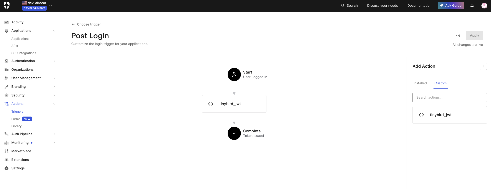

# Auth0 + Tinybird JWT

Check https://alrocar.github.io/tinybird-auth0-jwt/ for a demo.

The workflow is:

1. Login to Auth0
2. Get a JWT token from a Tinybird workspace with read permissions on a pipe as part of the post-login Auth0 workflow
3. Use the JWT token to fetch data from Tinybird

## Create the action

- Go to Auth0 > Actions > Triggers > post-login
- Add a new custom action:

```js
const jwt = require("jsonwebtoken");

exports.onExecutePostLogin = async (event, api) => {
  if (!event.secrets.TINYBIRD_ADMIN_TOKEN) {
    console.log("Tinybird Admin Token is missing. Create a secret with name TINYBIRD_ADMIN_TOKEN.");
    return;
  }

  if (!event.configuration.TINYBIRD_WORKSPACE_ID) {
    console.log(
      "Tinybird Workspace ID is missing. Create a configuration variable with name TINYBIRD_WORKSPACE_ID."
    );
    return;
  }

  if (!event.configuration.TINYBIRD_PIPE_NAMES) {
    console.log(
      "Tinybird Pipe Names is missing. Create a configuration variable with name TINYBIRD_PIPE_NAMES."
    );
    return;
  }

  const scopes = event.configuration.TINYBIRD_PIPE_NAMES.split(",").map((pipeName) => ({
    type: "PIPES:READ",
    resource: pipeName,
  }));

  const payload = {
    workspace_id: event.configuration.TINYBIRD_WORKSPACE_ID,
    name: `tinybird_jwt_${event.user.id}`,
    scopes,
  };

  const options = {
    expiresIn: "7d",
  };

  const secret = event.secrets.TINYBIRD_ADMIN_TOKEN;
  const token = jwt.sign(payload, secret, options);
  api.user.setAppMetadata("tinybirdJWT", token);

  if (event.authorization) {
    api.idToken.setCustomClaim("https://app.tinybird.co", token);
  }

  console.log(`Tinybird JWT token set for user`);
};
```

- Configure the action with the required secrets and configuration variables
- Save the action
- Modify the trigger to use the action



## How to get the JWT token after login

After the user logs in, you can get the JWT token from the user object.

```javascript
const user = await auth0Client.getUser();
const tinybirdJWT = user["https://app.tinybird.co"];
```

You can use this token to fetch data from Tinybird. See this [example](https://alrocar.github.io/tinybird-auth0-jwt/) for more information.
